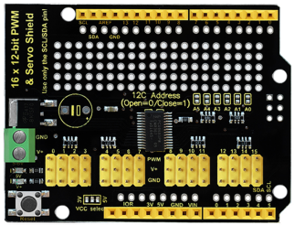
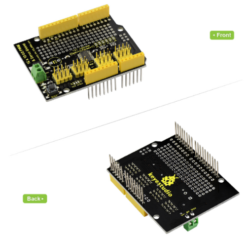
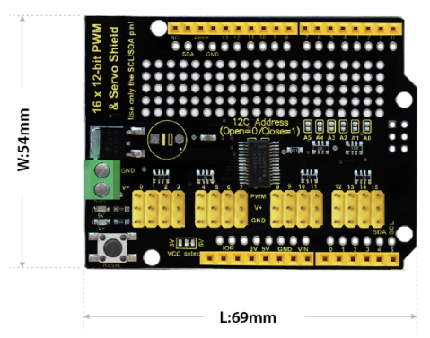
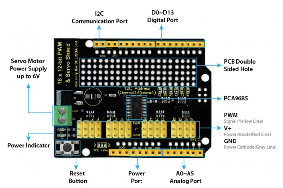
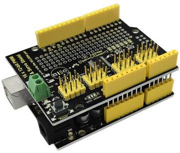
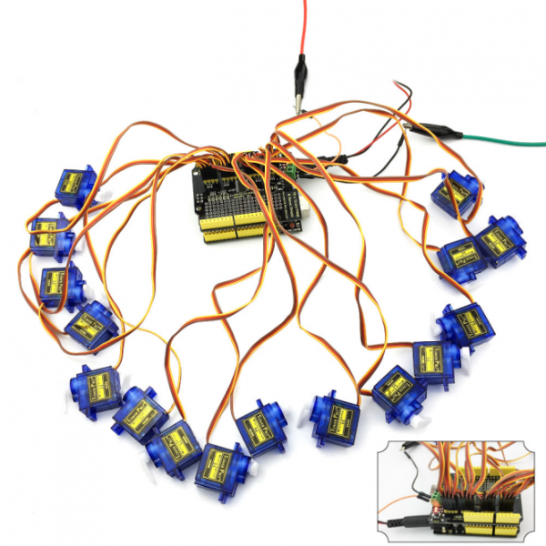

# KS0258 keyestudio 16-channel Servo Motor Drive Shield



## 1. Introduction

When we are doing robot experiments, it needs to use multiple PWM ports to drive the servo motor, however, the commonly-used Arduino UNO R3 only has 6 PWM ports, really not enough. This allows you to use this expansion board, which is directly stacked on the Arduino UNO R3 board. It can drive up to 16 servos and use I2C input, occupying A4 and A5 pins of UNO.

The shield also comes with PCB double-sided holes, which can be used to solder with components to build up prototyping circuits.



## 2. Specifications

- I2C input, controlling 16-channel PWM output
- Servo power independent input V+, up to 6V.
- Logic signal and logic power independent output 3-5V
- Frequency: 40-1000Hz
- Channels: 16-channel
- Resolution: 12-bit

## 3. Details

- **Dimensions:** 69mm x 54mm x 24mm
- **Weight:** 20g



## 4. Interface Explanation



## 5. Simple Hookup

Simply stack the shield onto UNO R3 board.



## 6. Sample Code

```c
/*************************************************** 
  This is an example for our keyestudio 16-channel PWM & Servo driver
  PWM test - this will drive 16 PWMs in a 'wave'

  The Servo Shield uses I2C to communicate, 2 pins are required to  
  interface. For Arduino UNOs, thats SCL -> Analog 5, SDA -> Analog 4

  keyestudio invests time and resources providing this open source code, 
  please support keyestudio and open-source hardware by purchasing 
  products from keyestudio !
 ****************************************************/

#include <Wire.h>
#include <Adafruit_PWMServoDriver.h>

// called this way, it uses the default address 0x40
Adafruit_PWMServoDriver pwm = Adafruit_PWMServoDriver();
// you can also call it with a different address you want
//Adafruit_PWMServoDriver pwm = Adafruit_PWMServoDriver(0x41);

void setup() 
{
  Serial.begin(9600);
  Serial.println("16 channel PWM test!");

  // if you want to really speed stuff up, you can go into 'fast 400khz I2C' mode
  // some i2c devices dont like this so much so if you're sharing the bus, watch
  // out for this!

  pwm.begin();
  pwm.setPWMFreq(50); //maximum is 1600
    
  // save I2C bitrate
  //uint8_t twbrbackup = TWBR;
  // must be changed after calling Wire.begin() (inside pwm.begin())
  //TWBR = 12; // upgrade to 400KHz!   
}

void loop() 
{
  // Drive each PWM in a 'wave'
  // "safe" limits of 200 and 400 are used here to protect servos with undetermined end stop points
  for (uint16_t i=200; i<400; i += 4) {
    for (uint8_t pwmnum=0; pwmnum < 16; pwmnum++) 
    {
      pwm.setPWM(pwmnum, 0, i);
     }
    delay(2);
  }
}
```

## 7. Test Result

Done uploading the above code to UNO R3. Then connect 16 servo motors shown below, finally you should see 16 servos rotate successively.

